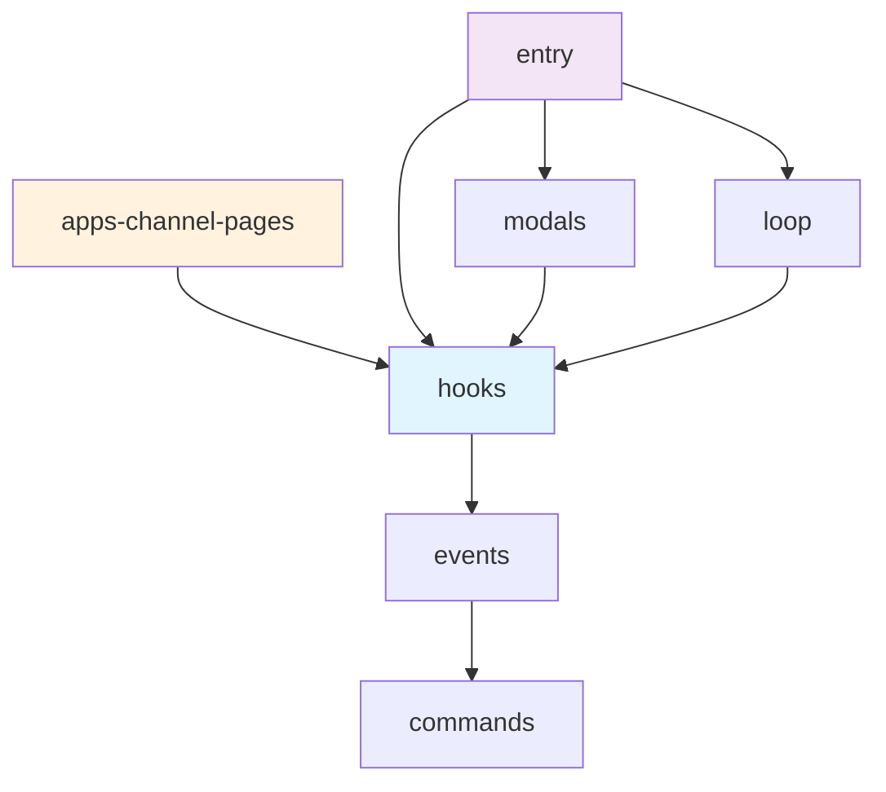

# Wave 5 Implementation Plan — Cleanup, Refactoring, and New Features

**Date:** 2026-02-17
**Based on:** Comprehensive code review (docs/CODE-REVIEW.md)
**Goal:** Remove noise, improve structure, add high-value features. Net reduction in code, net improvement in output.

---

## Overview

Three workstreams executed in order:

| # | Workstream | What | Net Lines |
|---|-----------|------|-----------|
| A | **Cleanup** — Remove noisy detectors, dead code | Delete 6 detector files, update registry, fix tests | -371 |
| B | **Refactor** — Split LLM adapter, adjust budgets, improve fingerprinter | Restructure 610-line monolith into 5 focused modules | ~0 (restructure) |
| C | **New features** — Example extractor, plugin system, Mermaid diagrams | Add 3 high-value capabilities | +500 |
| | **Net** | | **+129** |

---

## Workstream A: Cleanup (Remove Noise)

### A1: Remove 6 Noisy Convention Detectors

**Files to DELETE:**

| File | Lines | What It Produces | Why Remove |
|------|-------|-----------------|-----------|
| `src/detectors/import-patterns.ts` | 89 | "Barrel imports (99%)", "Relative imports (38%)" | Universal — every project has these |
| `src/detectors/export-patterns.ts` | 66 | "Named exports (99%)", "Barrel re-exports" | Universal — linters enforce this |
| `src/detectors/component-patterns.ts` | 54 | "displayName convention", "React components (3%)" | DevTools feature, not AI context |
| `src/detectors/error-handling.ts` | 52 | "Try-catch (17%)" | Redundant with AST contentSignals |
| `src/detectors/graphql-patterns.ts` | 57 | "GraphQL hooks" | Superseded by data-fetching detector |
| `src/detectors/telemetry-patterns.ts` | 53 | "Telemetry instrumentation (40%)" | Org-specific (@msteams), not generic |
| **Total removed** | **371** | | |

**Files to MODIFY:**

`src/convention-extractor.ts`:
- Remove all 6 imports for deleted detectors
- Remove all 6 entries from DETECTOR_REGISTRY
- Remove the GraphQL suppression logic (lines 79-92) — no longer needed since graphql-patterns is deleted
- Keep: fileNaming, hookPatterns, testPatterns + all 5 ecosystem detectors (Wave 2)

After cleanup, DETECTOR_REGISTRY contains:

```typescript
const DETECTOR_REGISTRY: Record<string, ConventionDetector> = {
  // Core (kept)
  fileNaming: fileNamingDetector,
  hookPatterns: hookPatternDetector,
  testPatterns: testPatternDetector,
  // Ecosystem-specific (Wave 2 — kept)
  testFrameworkEcosystem: testFrameworkEcosystemDetector,
  dataFetching: dataFetchingDetector,
  database: databaseDetector,
  webFramework: webFrameworkDetector,
  buildTool: buildToolDetector,
};
```

8 detectors (was 14). The remaining detectors produce specific, actionable conventions.

**Also remove from types.ts:**
- Remove unused ConventionCategory values: `"imports"`, `"exports"`, `"components"`, `"error-handling"`, `"graphql"`, `"telemetry"`, `"state-management"`
- Keep: `"file-naming"`, `"hooks"`, `"testing"`, plus add ecosystem categories if needed

**Test updates:**
- `test/impact-classifier.test.ts`: Update test fixtures that reference "imports", "exports", "telemetry" categories — either change to valid categories or remove those test cases
- `test/anti-pattern-detector.test.ts`: The "named exports" test fixture still works because anti-pattern detector receives conventions, it doesn't generate them. But verify.
- `test/wave2-improvements.test.ts`: The GraphQL hallucination tests (lines 127, 144, 190) test the output VALIDATOR, not the detector — these stay.
- `test/integration.test.ts`: Only checks `conventionNames.length > 0` — will pass with fewer conventions.

### A2: Clean Up Related Code

**In `src/impact-classifier.ts`:**
- Remove classification rules for deleted categories ("imports" → low, "exports" → low, etc.)
- Simplify since fewer categories exist

**In `src/anti-pattern-detector.ts`:**
- Remove inversion rules for deleted convention types
- The detector still works for remaining conventions (file-naming, hooks, testing)

**In `src/llm-adapter.ts` serialization:**
- No change needed — it serializes whatever conventions exist

---

## Workstream B: Refactoring

### B1: Split LLM Adapter (610 lines → 5 files)

Current `src/llm-adapter.ts` mixes 5 concerns. Split into:

| New File | Lines | Responsibility | Functions Moved |
|----------|-------|---------------|-----------------|
| `src/llm/client.ts` | ~100 | HTTP only — call Anthropic API, retry, timeout | `callLLM()`, `callLLMWithRetry()` |
| `src/llm/serializer.ts` | ~250 | Convert StructuredAnalysis to markdown for LLM input | `serializeToMarkdown()`, `serializePackageToMarkdown()`, `serializePackage()`, `sanitize()` |
| `src/llm/template-selector.ts` | ~40 | Pick the right template for the output format | `getTemplate()`, template imports |
| `src/llm/hierarchical.ts` | ~120 | Multi-file output: root + per-package generation | `formatHierarchical()`, `toPackageFilename()` |
| `src/llm/adapter.ts` | ~100 | Orchestration: serialize → call LLM → validate → output | `formatWithLLM()`, `validateAndCorrect()` |

**Keep `src/llm-adapter.ts` as a re-export barrel** for backward compatibility:
```typescript
// src/llm-adapter.ts — backward-compatible re-exports
export { formatWithLLM, formatHierarchical, type HierarchicalOutput } from "./llm/adapter.js";
```

This way, nothing that imports from `llm-adapter.ts` breaks.

**Move validation integration into `adapter.ts`:**
The `validateAndCorrect()` function stays with the orchestration layer since it coordinates between LLM call and validation.

### B2: Adjust Budget Limits

**In `src/budget-validator.ts`:**

| Limit | Current | New | Rationale |
|-------|---------|-----|-----------|
| Root AGENTS.md | 60-80 lines | 80-100 lines | Allows workspace commands + workflow rules |
| Package detail | 60-90 lines | 100-150 lines | Allows richer API coverage + examples |
| Warning threshold (root) | >100 rules | >120 rules | Aligned with research (150 max, 50 used by system) |
| Warning threshold (package) | >120 lines | >180 lines | Package details can be comprehensive |

**In `src/templates/agents-md.ts`:**
Update the system prompt line count targets:
- Single package: "Target 80-120 lines" (was "60-80 lines")
- Multi-package root: "Target 80-100 lines" (was "60-80 lines")
- Package detail: "Target 100-150 lines" (was "60-90 lines")

### B3: Improve Pattern Fingerprinter

**In `src/pattern-fingerprinter.ts`:**

**Current problem:** Produces abstract shapes like `"parameterShape": "single config object"`. Not concrete enough.

**Change to produce:**
1. **Named implementations** — Instead of "routing system," list "SmartRouter, RegExpRouter, TrieRouter" (from export names)
2. **Actual parameter names** — Instead of "single config object," list the actual property names: `{ channelId, tabId, isLie, scenario }`
3. **Return value keys** — Instead of "returns object," list `{ tabData, loading, error }`
4. **1-line summary per export** — "useChannelPageTabData: fetches tab data with subscription, returns { tabData, loading, error }"

**Simplify the module:**
Remove the complex AST body walking for "async pattern", "state management", "complexity" — these produce noise. Keep:
- Parameter extraction (from function signature AST)
- Return shape extraction (from return statement AST)
- Internal call names (already tracked by call graph)

This should reduce the module from 370 to ~200 lines while producing better output.

---

## Workstream C: New Features

### C1: Example Extractor from Test Files

**New file:** `src/example-extractor.ts` (~200 lines)

**Purpose:** Extract real usage examples from test files for public API exports. A test showing `const { data, loading } = useData({ id: "123" })` is more useful than any abstract description.

**Algorithm:**

1. For each `PublicAPIEntry`, find test files that import it:
   - Walk `parsedFiles` where `isTestFile === true`
   - Check `imports` for the export name

2. For each matching test file, extract the test block:
   - Find the function body that contains a call to the export
   - Extract the surrounding 3-7 lines (setup → call → assertion)
   - Strip test framework boilerplate (describe, it, expect) to produce a clean snippet

3. Output:

```typescript
interface UsageExample {
  exportName: string;        // "useChannelPageTabData"
  testFile: string;          // "use-channel-page-tab-data.test.tsx"
  snippet: string;           // 3-7 lines of actual usage code
  context: string;           // "Shows how to fetch tab data with loading state"
}
```

**Integration:**
- Add `examples: UsageExample[]` to `PackageAnalysis`
- In the LLM serialization, include top 3 examples in the output
- Template instruction: "For key exports, include the usage example from test files"

**Why this beats pattern fingerprinting:**
- Concrete, real code vs abstract shapes
- Shows ACTUAL usage, not inferred patterns
- Tests are maintained by developers — they stay current
- AI tools can directly follow test patterns when writing new code

### C2: Plugin System for Org-Specific Detectors

**New file:** `src/plugin-loader.ts` (~120 lines)

**Purpose:** Allow organizations to add custom convention detectors without modifying the core engine.

**Architecture:**

```typescript
// Plugin interface
export interface DetectorPlugin {
  name: string;
  version: string;
  detect: ConventionDetector;
  // Optional: only run if these dependencies are present
  dependencies?: string[];
}

// Plugin loading
export function loadPlugins(pluginPaths: string[]): DetectorPlugin[];
```

**Plugin discovery:** Look for:
1. `autodocs.plugins` field in package.json → array of module paths
2. `.autodocs/plugins/` directory → any `.js` or `.ts` files
3. CLI flag: `--plugin <path>`

**Integration into convention-extractor.ts:**

```typescript
export function extractConventions(
  parsedFiles: ParsedFile[],
  tiers: Map<string, TierInfo>,
  disabledDetectors: string[],
  warnings: Warning[],
  context?: DetectorContext,
  plugins?: DetectorPlugin[],  // NEW
): Convention[] {
  // Run built-in detectors
  // Then run plugin detectors
  // Plugins can see the same data as built-in detectors
}
```

**Config addition:**

```json
{
  "plugins": ["./my-telemetry-detector.js"]
}
```

**Migration:** Move telemetry-patterns to `examples/plugins/telemetry-detector.ts` in the repo as a reference plugin implementation. This shows how to write a custom detector while keeping the core generic.

### C3: Mermaid Diagram Generator

**New file:** `src/mermaid-generator.ts` (~80 lines)

**Purpose:** Generate Mermaid diagrams for dependency graphs. Visual representation is easier to understand than text lists.

```typescript
export function generateDependencyDiagram(
  packages: PackageAnalysis[],
  dependencyGraph: PackageDependency[],
): string {
  const lines: string[] = ["```mermaid", "graph TD"];

  for (const edge of dependencyGraph) {
    const from = sanitizeId(edge.from);
    const to = sanitizeId(edge.to);
    lines.push(`  ${from}["${shortName(edge.from)}"] --> ${to}["${shortName(edge.to)}"]`);
  }

  // Color-code by package type
  for (const pkg of packages) {
    const id = sanitizeId(pkg.name);
    switch (pkg.architecture.packageType) {
      case "hooks": lines.push(`  style ${id} fill:#e1f5fe`); break;
      case "react-components": lines.push(`  style ${id} fill:#f3e5f5`); break;
      case "api-server": lines.push(`  style ${id} fill:#e8f5e9`); break;
      case "web-application": lines.push(`  style ${id} fill:#fff3e0`); break;
    }
  }

  lines.push("```");
  return lines.join("\n");
}
```

**Integration:**
- In `llm/serializer.ts` (after the split): add Mermaid diagram to cross-package serialization
- In template instructions: "If a Mermaid diagram is provided, include it in the Architecture section"
- Only generate for multi-package analysis (>1 package)

**Output in AGENTS.md:**
```markdown
## Package Dependencies


```

---

## Implementation Order

| Step | What | Files | Depends On | Est. Change |
|------|------|-------|-----------|-------------|
| **Workstream A: Cleanup** |
| 1 | Delete 6 noisy detector files | detectors/ | — | -371 lines |
| 2 | Update convention-extractor registry | convention-extractor.ts | Step 1 | -30 lines |
| 3 | Clean up ConventionCategory type | types.ts | Step 1 | -7 lines |
| 4 | Clean up impact-classifier | impact-classifier.ts | Step 1 | -20 lines |
| 5 | Clean up anti-pattern-detector | anti-pattern-detector.ts | Step 1 | -10 lines |
| 6 | Update tests | test/*.test.ts | Steps 1-5 | ±50 lines |
| **Workstream B: Refactor** |
| 7 | Create src/llm/ directory, split adapter | src/llm/*.ts, src/llm-adapter.ts | — | ±0 (restructure) |
| 8 | Adjust budget limits | budget-validator.ts, templates/agents-md.ts | — | ±10 lines |
| 9 | Simplify pattern-fingerprinter | pattern-fingerprinter.ts | — | -170 lines |
| **Workstream C: New Features** |
| 10 | Example extractor | new: example-extractor.ts | — | +200 lines |
| 11 | Plugin system | new: plugin-loader.ts, convention-extractor.ts | — | +150 lines |
| 12 | Mermaid diagram generator | new: mermaid-generator.ts, llm/serializer.ts | Step 7 | +100 lines |
| 13 | Pipeline integration for all new modules | pipeline.ts | Steps 10-12 | +30 lines |
| 14 | Tests for all changes | test/wave5-*.test.ts | All above | +200 lines |

**Total: 14 steps, ~650 lines added, ~608 lines removed = net +42 lines (but massively improved signal-to-noise).**

---

## Testing Plan

### After Workstream A (Cleanup):

```bash
npm test  # All remaining tests must pass (some tests removed/updated)
```

Verify: Convention count decreased but remaining conventions are high-signal.

Run on Channel Pages hooks:
```bash
npx tsx src/bin/autodocs-engine.ts analyze /path/to/hooks-package --dry-run 2>/dev/null | python3 -c "
import json, sys
d = json.loads(sys.stdin.read())
convs = d['packages'][0]['conventions']
print(f'Conventions: {len(convs)}')
for c in convs:
    print(f'  {c[\"name\"]}')
"
```

Should have ~8-12 conventions (was 18). None should be "barrel imports", "named exports", "displayName", "try-catch", or "GraphQL hooks".

### After Workstream B (Refactor):

```bash
npm test  # All tests still pass after restructuring
```

Verify: LLM adapter split didn't break any imports.
Verify: Budget limits allow 100+ line package files without warnings.

### After Workstream C (New Features):

Verify example extractor on hooks package:
```bash
npx tsx src/bin/autodocs-engine.ts analyze /path/to/hooks-package --dry-run | python3 -c "
import json, sys
d = json.loads(sys.stdin.read())
examples = d['packages'][0].get('examples', [])
print(f'Examples found: {len(examples)}')
for e in examples[:3]:
    print(f'  {e[\"exportName\"]}: {e[\"snippet\"][:80]}...')
"
```

Verify Mermaid diagram on multi-package:
```bash
npx tsx src/bin/autodocs-engine.ts analyze pkg1 pkg2 --dry-run | python3 -c "
import json, sys
d = json.loads(sys.stdin.read())
cross = d.get('crossPackage', {})
mermaid = cross.get('mermaidDiagram', '')
print(mermaid[:200])
"
```

Verify plugin loading:
```bash
npx tsx src/bin/autodocs-engine.ts analyze . --plugin ./examples/plugins/telemetry-detector.ts --dry-run
```

---

## Success Criteria

1. **Test count:** 180 existing tests adjusted (some removed from deleted detector tests, some updated) + new tests for Wave 5 features. All pass.
2. **Convention noise eliminated:** No "barrel imports", "named exports", "displayName", "try-catch (17%)" in any output.
3. **LLM adapter split clean:** No module imports break. Re-export barrel works.
4. **Budget allows richer output:** Package detail files can be 100-150 lines without warnings.
5. **Example extractor produces real code snippets** from test files.
6. **Plugin system loads external detector** and integrates conventions.
7. **Mermaid diagram visible** in multi-package JSON output.
8. **Benchmark score maintained or improved** (target: ≥7.5 with less noise).
